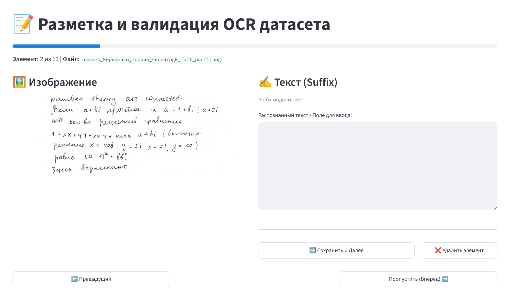

# OCR stuff

Несколько полезных скриптов для превращения (рукописного) PDF-файла
в датасет, пригодный для дообучения визуально-языковой модели
на задаче распознавания вашего почерка. 

Скрипт `prepare-pdf.py` принимает файл `my_notes.pdf`, 
создает директорию `./dataset_my_notes/`, 
разрезает каждую страницу на 4 чанка и сохраняет их
в формате .png в `./dataset_my_notes/images_my_notes/`, 
формирует jsonl файл `./dataset_my_notes/my_notes.jsonl` 
формата `{"image": "./images_my_notes/imege_name.png", 
"prefix": "ocr", "suffix": ""}`. 
Использование: 

```
python prepare_pdf.py my_notes.pdf --single
```

Используется `--single`, если на одной странице документа
одна отсканированная страница 
текста (по умолчанию -- разворот из двух страниц). 
Используется `--chunks 8`, если текст мелкий и надо разделить 
страницу на большее число чанков. 

Скрипт `markup.py` прдназначен для удобного редактирования 
такого датасета. Использование:

```
streamlit run markup.py
```

Пример использования:


